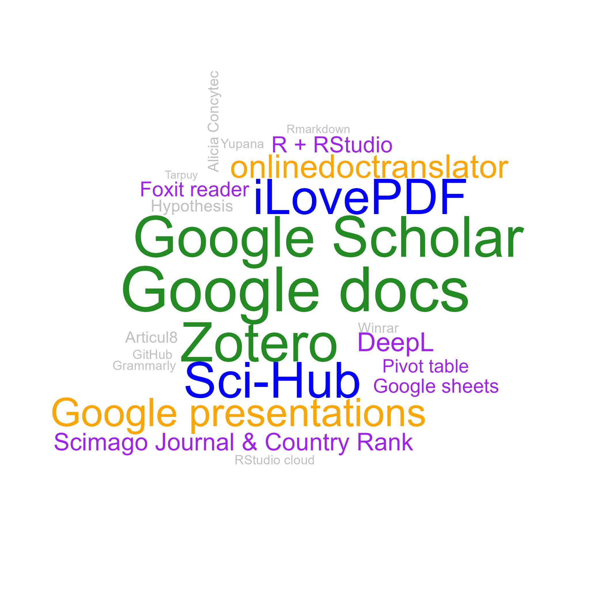

**Journal Club as a Teaching-Learning Strategy: A Case for Plant Genetics Lectures During the COVID-19 Pandemic**

Flavio Lozano-Isla^a, c\*^; Elizabeth Heros-Aguilar^a^; Andres Casas-Diaz^b^

^a^ *Departamento Académico de Fitotecnia, Facultad de Agronomía, Universidad Nacional Agraria La Molina, Lima, Perú.*

^b^ *Departamento Académico de Horticultura, Facultad de Agronomía, Universidad Nacional Agraria La Molina, Lima, Perú.*

^c^ Present affiliation: *Instituto de Investigación para el Desarrollo Sustentable de Ceja de Selva, Universidad Nacional Toribio Rodríguez de Mendoza de Amazonas, Chachapoyas, Perú.*

\*Corresponding author. Email: [flozanoisla@gmail.com](mailto:flozanoisla@gmail.com) 

ORCID IDs:

Flavio Lozano-Isla: 0000-0002-0714-669X

Elizabeth Heros-Aguilar: 0000-0002-0179-3124

Andres Casas-Diaz: 0000-0001-7461-3924


**DECLARATIONS**

**Funding**

The National Agrarian University La Molina supported this work through the Center for Educational Innovation and the Research Unit of the Faculty of Agronomy.

**Data and code availability** 

The data analysis was performed via Quarto, an open-source platform for reproducibility in scientific and technical publishing. Access to the data and the analysis can be found in the supplementary information. All the documents, data, and analysis will be available in the GitHub repository: [https://github.com/Flavjack/journalclub](https://github.com/Flavjack/journalclub) 

**Author contributions**

Flavio Lozano-Isla: conceptualization, data curation, formal analysis, investigation, methodology, and writing (original draft). Elizabeth Heros-Aguilar: project administration, validation, writing, review, & editing. Andres Casas-Diaz: supervision, writing, review, & editing.

**Acknowledgments**

To E. Rios and V. Landa for the training and their motivation to improve the course that resulted in the present manuscript. To R. Ortiz for suggestions to improve the manuscript. To the students who participated in the project.


**Ethics declarations**

**Ethics approval and consent to participate**

This study did not require approval from a research ethics committee as per institutional guidelines. The project was endorsed and approved by the university. The participants were fully informed about the study's purpose, and their participation was entirely voluntary and anonymous. The data collected, including those from databases and surveys, did not contain any personally identifiable information

**Competing interests**

The authors have no relevant financial or nonfinancial interests to disclose.

# 

# Abstract

The COVID-19 pandemic presented significant challenges for both students and educators, particularly because of the virtualization of classes and the consequent lack of practical sessions following the closure of laboratories and experimental fields in universities. The absence of interaction among students and practical classes led to a diminished interest in studies, as students found it difficult to connect theoretical knowledge with practical application. This study explores the implementation of a Journal Club (JC) as a collaborative-metacognitive use of the science literature teaching approach (CMSLTA) to enhance theoretical and practical knowledge through the reading and discussion of scientific literature in an e-learning environment. In this approach, students read scientific articles, write essays, and engage in group discussions. The methodology was applied over two consecutive academic semesters in 2021 and 2022 within plant genetics courses. Academic achievement was evaluated through essay assessments, and surveys were conducted at the end of each semester. The results revealed notable progress in student grades throughout the semester, with over 80% of participants endorsing JC implementation and recognizing its relevance to their education. The Journal Club facilitated the integration of theoretical knowledge covered in lectures and equipped students with various digital research tools.


**Keywords:** journal club ~;~ crop sciences; research tools; e-learning; scientific articles

# 

```Unknown element type at this position: UNSUPPORTED```# Introduction

On March 11, 2020, the World Health Organization declared that the SARS-CoV-2 outbreak had caused a pandemic. This has created a new challenge for students and lecturers in implementing remote distance learning worldwide [[1, 2]](https://www.zotero.org/google-docs/?PHXGqF). Video conferencing tools such as Zoom, Google Meet, and Microsoft Teams have become the predominant means of both education and social interaction.

The journal club (JC) is a longstanding and widely used method in undergraduate and graduate teaching, with a history that extends over approximately 200 years [[3]](https://www.zotero.org/google-docs/?uQG5Nf). Dr. James Paget coined the term "journal club" in 1835. Initially, it was so named because doctors at St. Bartholomew's Hospital in London would gather in a room to read medical journals. However, in 1875, Sir William Osler transformed these gatherings into regular meetings where doctors and students convened to critique and deliberate over published materials. As a result, journal clubs have established a strong and long tradition in the medical sciences [[4]](https://www.zotero.org/google-docs/?RKc2ri).

The initial purpose of the Journal Club (JC) was to assist physicians in keeping up to date with the latest research and applying research findings in clinical practice. It fosters collaborative learning and encourages the cultivation of continuous study [[5]](https://www.zotero.org/google-docs/?n3nAMU).  However, participants can achieve several objectives during Journal Club sessions, including disseminating scientific information, transferring knowledge, staying current with the literature, and developing critical thinking and analytical skills. The JC also acts as a motivating tool [[6]](https://www.zotero.org/google-docs/?wi6LC5) and makes studying more manageable. While journal clubs have been integrated into the medical education system [[7]](https://www.zotero.org/google-docs/?Pd0S9a), research examining the efficacy of journal clubs in imparting evidence-based practices to professionals in the field of plant science is scarce.

The pandemic highlighted the continuous necessity for educational research focused on pedagogy [[8]](https://www.zotero.org/google-docs/?lFJVPY). This emphasized the importance of investigating how instructors can optimally transition their teaching methods from face-to-face to remote [[9]](https://www.zotero.org/google-docs/?w9Ibqw). The journal club could be classified as an active and participatory pedagogical tool. In this type of teaching, students are responsible for their learning and actively participate in the discussion and analysis of scientific literature [[10]](https://www.zotero.org/google-docs/?UdQwn6). In this context, implementing a JC for education virtualization could be beneficial. A JC could be an interesting alternative to replace and/or complement practical lectures in university courses that require the use of laboratory or field practices.

The present work was part of a pedagogical training course entitled "Designing my course" for professors starting their academic careers at the university. Each professor was encouraged to implement an improvement methodology in one of the lectures of his or her specialty. We describe and analyze the implementation of an e-learning JC during two academic semesters for plant genetics lectures via the collaborative-metacognitive use of the science literature teaching approach (CMSLTA). 

The primary hypothesis posited that the integration of JC could enhance the ability to connect lecture topics in an environment where practical knowledge was limited due to COVID-19 restrictions. 

# Conceptual framing: e-Learning, Journal Club, CMSLTA, and Seven Cs 

## E-Learning: online or distance learning

E-learning is a term that refers to online or distance learning, which uses digital technologies to deliver education and training over the internet [[11, 12]](https://www.zotero.org/google-docs/?aK7hST). Learning materials are delivered through an online learning platform and may include videos, readings, quizzes, discussion forums, and other interactive activities [[13]](https://www.zotero.org/google-docs/?SAWuOG). Students can access learning materials from anywhere and at any time, increasing their flexibility in their learning [[14]](https://www.zotero.org/google-docs/?hfhIKN).

During the COVID-19 pandemic, many universities around the world adopted e-learning to continue online teaching and learning [[1]](https://www.zotero.org/google-docs/?tcBAPq). The pandemic forced many educational institutions to temporarily close their campuses and look for alternatives to continue offering education to students [[15]](https://www.zotero.org/google-docs/?bxDL1p). E-learning has become a popular option, allowing students to continue their education from home and remain safe during the pandemic. Many universities use online tools and platforms to offer live, recorded lectures, assignments, and assessments to students.

## Journal Club

A journal club is a group meeting where recent scientific articles are discussed. These meetings are common in academic and medical settings but can also be held in other contexts, such as in a company or study group [[6, 16, 17]](https://www.zotero.org/google-docs/?vuAU0q). For over a century, physicians have widely utilized journal clubs as valuable tools for enhancing their critical assessment skills [[4, 7, 18]](https://www.zotero.org/google-docs/?6nHKEE).

The main objective of a journal club is to promote critical discussion and the exchange of ideas about recent research in a given field. The participants read and analyzed selected articles before the meeting and then discussed their findings, methods, and conclusions. This helps keep participants updated with the latest research and allows them to learn from others [[5]](https://www.zotero.org/google-docs/?2g8YEC). A journal club can also be an opportunity to improve critical and communication skills, as participants must explain and justify their views in a respectful and constructive environment.

In a university environment, a journal club can be an excellent way to encourage critical discussion and the exchange of ideas between students and professors. Students can have the opportunity to learn from professors and peers about the latest research in their field, and professors can take the opportunity to guide students in critically analyzing the literature [[17]](https://www.zotero.org/google-docs/?3mNGIe).

## Collaborative-metacognitive use of the science literature teaching approach

The collaborative-metacognitive use of science literature teaching approach (CMSLTA) is a pedagogical strategy that focuses on the use of collaborative and metacognitive scientific literature to enhance comprehension and critical thinking in science students [[19]](https://www.zotero.org/google-docs/?GUU9dV). The goal of the CMSLTA approach is to help students develop skills in reading, comprehending, analyzing, and evaluating scientific texts, as well as working in teams to discuss and solve complex problems in science [[20, 21]](https://www.zotero.org/google-docs/?Xigcp8). The CMSLTA strategy is based on the idea that active and collaborative learning, as well as metacognitive reflection on the learning process itself, can enhance the understanding of science and promote advanced cognitive skills.

The journal club could be considered the CMSLTA. It refers to a teaching approach that engages students in the discussion and critical analysis of scientific literature, with a focus on the development of metacognitive skills such as reflection and self-regulation.

In the context of the present implementation of JC, students work together to read and analyze scientific articles and discuss their findings, methods, and conclusions. This allows them to develop metacognitive skills by reflecting on their learning process and considering the perspective of others. In addition, working collaboratively in a journal club allows students to learn from their peers and teachers and improve their communication and presentation skills. It also allows them to learn to work in teams and to develop leadership and problem-solving skills. 

## Seven Cs

The concept of the seven Cs refers to a framework of twenty-first-century skills. It is composed of seven key elements: communication, collaboration, creativity, critical thinking, cross-cultural understanding, computerized/information and communication technologies, and career/lifelong learning [[19]](https://www.zotero.org/google-docs/?zdVyo0). These elements are important for any type of communication, whether written or oral, and are especially useful in professional and academic environments. By following the principles of the seven Cs, the quality of communication can be improved, and the comprehension and effectiveness of the messages transmitted can be increased. 

The implementation of a journal club could reinforce the following concepts:

1. Communication: The JC allows students to develop their communication skills by presenting their findings and discussing their ideas with their peers and professors.
1. Collaboration: By working together to analyze and discuss scientific literature, students can develop collaborative skills and learn to work as a team.
1. Critical thinking: By analyzing and discussing scientific literature, students can develop their ability to think outside the box and find creative solutions to scientific problems.
1. Criticism: By evaluating and discussing scientific literature, students can develop their critical thinking skills and evaluation of evidence.
1. Cross-cultural understanding: By learning about research in a global context, students can develop a deeper and more respectful understanding of different cultures and perspectives.
1. Computerized/information and communication technologies: By using technology to explore, read, and discuss scientific literature, students can develop their digital skills.
1. Career/lifelong learning: JC is an active learning methodology that promotes keeping up-to-date with the literature and promotes self-learning, allowing long-term learning.


```Unknown element type at this position: UNSUPPORTED```# Method

## Scope and Delimitations

The journal club (JC) was implemented in a plant genetics lecture. A total of 90 third-year agronomy students participated. The implementation took place during two academic semesters in 2021 and 2022. Each academic semester has a period of 16 weeks. The project was endorsed and approved by the university. The students were informed of the project, and the surveys were conducted voluntarily.

## Teaching Approach

At the beginning of the course, all the students received training in the use of tools and web resources. Each journal club (i.e., article) was divided into three weeks with a duration of 60 minutes per session. In the first week, the students began by reading the article; in the second week, they focused on writing their essays; and in the third week, the article was discussed collectively ([Figure  @fig:kix.496kixf5gqtx]:). Despite the oral language being Spanish, all the articles were read in English ([Table  @tbl:id.fuoxt4sat4od]:). All the sessions were conducted virtually through the Zoom platform. The methodology is explained in more detail below.


```Unknown element type at this position: UNSUPPORTED```


| **JC**                                                                                                                                                                                            | **Semester**                                                                                                                                                                                      | **Title**                                                                                                                                                                                         | **Year**                                                                                                                                                                                          | **Journal**                                                                                                                                                                                       | **Type**                                                                                                                                                                                           |
|---------------------------------------------------------------------------------------------------------------------------------------------------------------------------------------------------|---------------------------------------------------------------------------------------------------------------------------------------------------------------------------------------------------|---------------------------------------------------------------------------------------------------------------------------------------------------------------------------------------------------|---------------------------------------------------------------------------------------------------------------------------------------------------------------------------------------------------|---------------------------------------------------------------------------------------------------------------------------------------------------------------------------------------------------|----------------------------------------------------------------------------------------------------------------------------------------------------------------------------------------------------|
| 1                                                                                                                                                                                                 | 2021-2                                                                                                                                                                                            | [Breeding crops to feed 10 billion](https://www.nature.com/articles/s41587-019-0152-9)                                                                                                            | 2019                                                                                                                                                                                              | nature biotechnology                                                                                                                                                                              | review article                                                                                                                                                                                     |
| 2                                                                                                                                                                                                 | 2021-2                                                                                                                                                                                            | [Imaged-based phenotyping accelerated QTL mapping and qtl × environment interaction analysis of testa colour in peanut (Arachis hypogaea)](https://onlinelibrary.wiley.com/doi/10.1111/pbr.12905) | 2021                                                                                                                                                                                              | plant breeding                                                                                                                                                                                    | research article                                                                                                                                                                                   |
| 3                                                                                                                                                                                                 | 2021-2                                                                                                                                                                                            | [Genetic patterns offer clues to evolution of homosexuality](https://www.nature.com/articles/d41586-021-02312-0)                                                                                  | 2021                                                                                                                                                                                              | nature                                                                                                                                                                                            | news                                                                                                                                                                                               |
| 4                                                                                                                                                                                                 | 2021-2                                                                                                                                                                                            | [Heritability in Morphological Robot Evolution](https://doi.org/10.48550/arXiv.2110.11187)                                                                                                        | 2021                                                                                                                                                                                              | arxiv                                                                                                                                                                                             | research article                                                                                                                                                                                   |
| 1                                                                                                                                                                                                 | 2022-1                                                                                                                                                                                            | [Genome-edited crops for improved food security of smallholder farmers](https://www.nature.com/articles/s41588-022-01046-7)                                                                       | 2022                                                                                                                                                                                              | nature genetics                                                                                                                                                                                   | review article                                                                                                                                                                                     |
| 2                                                                                                                                                                                                 | 2022-1                                                                                                                                                                                            | [Crucial factors for the feasibility of commercial hybrid breeding in food crops](https://www.nature.com/articles/s41477-022-01142-w#Tab1)                                                        | 2022                                                                                                                                                                                              | nature plants                                                                                                                                                                                     | review article                                                                                                                                                                                     |
| 3                                                                                                                                                                                                 | 2022-1                                                                                                                                                                                            | [Semiautomated Feature Extraction from RGB Images for Sorghum Panicle Architecture GWAS](https://academic.oup.com/plphys/article/179/1/24/6116437)                                                | 2019                                                                                                                                                                                              | plant physiology                                                                                                                                                                                  | research article                                                                                                                                                                                   |
| 4                                                                                                                                                                                                 | 2022-1                                                                                                                                                                                            | [A chromosome predisposed for sex](https://www.nature.com/articles/d41586-022-01129-9)                                                                                                            | 2022                                                                                                                                                                                              | nature                                                                                                                                                                                            | news                                                                                                                                                                                               |


: Reading materials for the journal club implemented during the academic semesters of 2021 and 2022 in the plant genetics lectures amidst the challenges of the COVID-19 pandemic. {#tbl:id.fuoxt4sat4od}


```Unknown element type at this position: UNSUPPORTED```**Training - Research tools:** Students learn diverse tools that will enable the appropriate use of software and applications for reading articles and writing essays. Among these tools was Zotero in the desktop version as the web connector, Google Docs, Hypothesis, and web translators (i.e., Google Translate, DeepL, and DocTranslator), and Articul8 (Google Docs extension). The training stage was in the first week of each semester and took 120 minutes.

**Week 1 - Reading articles:** Students were assigned into random groups of three to four. The groups and the randomization were made automatically in the Moodle system. The article was introduced at the beginning of the session and the students had 30 minutes to read it and extract all the essential information. At the end of the reading time, the main points in the article are discussed (i.e., topic, research question, hypothesis, and main results).

**Week 2 - Essay writing:** In the first 40 minutes the students in groups began to organize the writing of their essays. In the remaining 20 minutes, guidance on how to improve essay writing or provide feedback from the previous JC was provided. 

**Week 3 - Reading discussion:** In the first 30 minutes, the students were randomly grouped with members of other groups to discuss their ideas and points of view based on the article read. At the end of that period, all students were returned to the main room for the general discussion guided by the professor. If there were no initial opinions, the professor asked questions and probed their reading to encourage further discussion by presenting different ideas and opinions. In some sessions, slides were used to present case studies or experiences related to the article topic to motivate the discussion. At the end of the session, the students must submit their essays as the final product of the JC.


{#fig:kix.496kixf5gqtx}

## Instrument

**Survey design:** At the end of the course a survey was designed to determine the level of satisfaction with JC implementation. In addition, objective questions were included to evaluate the tools that participants learned and used during the course ([Table  @tbl:id.es7ldr5wrwnj]:, ESM 2). The survey was voluntary and anonymous to allow students to express their opinions without any restrictions.


| **Number**                                                   | **Question**                                                  |
|--------------------------------------------------------------|---------------------------------------------------------------|
| 1                                                            | Were the articles difficult to understand?                    |
| 2                                                            | Was the time for each journal club adequate?                  |
| 3                                                            | Should we read fewer articles?                                |
| 4                                                            | Should we read more articles?                                 |
| 5                                                            | Was the number of articles appropriate?                       |
| 7                                                            | Did you like the articles?                                    |
| 8                                                            | Do you consider the Journal Club relevant to your education?  |
| 9                                                            | Do you agree with its implementation?                         |


: Questions of the survey to evaluate the level of satisfaction of the journal club in the plant genetics lectures during the period 2021 and 2022. {#tbl:id.es7ldr5wrwnj}

**Objective rubric:** Writing an essay was the final product of each journal club series (i.e., every three weeks). Grading was based on the use of an objective rubric. The rubric considered three main aspects of the evaluation: attitude, writing, and format. In the attitude aspect, punctuality was taken into account. Although the essays had a set due date, students could submit their work after the deadline with a penalty to the final grade. In terms of writing, the structure and content of the introduction, summary, and discussion of the readings were evaluated. For formatting, references and the overall structure of the final document were considered (Table S1). The dependent variable in this study was academic achievement. The independent variable was derived from the rubric criteria established according to the guidelines set by the Peruvian Ministry of Education, which employs a scoring system ranging from 0–20. Five levels of achievement were identified: (i) fail (0–10.4), (ii) sufficient (10.5–13.5), (iii) good (13.6–16), (iv) very good (16.1–18.5), and (v) excellent (18.6–20). 

The names of the participants were removed from the grading book to maintain the privacy of the students (ESM 2).


## Data collection and analysis

Data analysis was performed via the statistical software R version 4.4.1 ([R Core Team, 2020](https://www.zotero.org/google-docs/?U07ghK)). The scores were analyzed using a linear model taking into account the interaction of the factors: the journal club sessions, the section, and the semester of methodology implementation. The obtained results were subjected to analysis of variance to assess the interaction between the factors. The estimated marginal means and the pairwise comparisons test were performed with the *emmeans* [[23]](https://www.zotero.org/google-docs/?lIGMen) and *multcomp* [[24]](https://www.zotero.org/google-docs/?pVBDKG) R packages respectively. The graphs were made with the *inti* package. Qualitative data analysis and graphs were analyzed by the frequency of occurrence of terms with the *wordcloud* package [[25]](https://www.zotero.org/google-docs/?2YZZUI). 

The replicable analysis was carried out via Quarto, an open-source system for scientific and technical publishing (ESM 3, [[26]](https://www.zotero.org/google-docs/?dAkyH6)).

# Results

## Student perception

An objective survey was designed to evaluate the students' perceptions of the journal club under synchronous e-learning during the COVID-19 pandemic. The survey was conducted at the end of the semester at plant genetic lectures during two academic semesters in 2021 and 2022. 

Approximately 84.4% of the students agreed with JC implementation and 83.3% considered it relevant to their education. Regarding the articles read, 74.4% liked the articles chosen, whereas 84.4% indicated that the number of articles was adequate for the duration of the course. Additionally, 60% considered not reducing the number of articles, and 45% suggested increasing the number of articles to read. According to 87.8% of the students, the timing of each JC was adequate. At least 14% of the students rated the chosen articles as difficult to understand, whereas 72.2% of the students found their understanding medium to difficult ([Figure  @fig:id.pmcc7d4jkx1a]:).


{#fig:id.pmcc7d4jkx1a}

To evaluate students' perceptions of JC implementation, an open-ended question was added to the anonymous survey. This question invited students to share their opinions, comments, and/or recommendations for the JC (ESM 2).

The participants positively criticized the implementation of the reading club methodology, noting that it "increases the level of reading and comprehension" and should be implemented in more courses. One student mentioned that this initiative is "very good, as it teaches students about scientific articles," which fosters academic writing and research. Another recurring point was the encouragement of research and the use of digital tools. One participant commented that the club "greatly promoted research and the use of digital tools," which is crucial in the current educational context. This approach was also praised for its ability to broaden students' horizons and improve their writing skills.

The JC not only facilitated individual learning but also strengthened group dynamics. This promoted "camaraderie and responsibility" among the students. This group interaction was seen as positive, especially in discussion and debate activities about the read articles, which helped students "share and debate ideas" effectively. While the opinions were mostly positive, some participants noted challenges. For example, one student mentioned that some articles were "complex to understand" However, these initial difficulties also led to better learning, as another student commented: "I used to find reading the articles a bit complicated, but now I've learned to interpret them better."

Several students highlighted the importance of this experience for their professional development. One student emphasized that reading scientific articles is "important for our training as professionals," whereas another mentioned how the activity helped improve their critical and analytical skills.

## Progress in essay grades

The present implementation includes essay writing to enhance conceptual understanding, foster critical thinking, and develop communication skills [[27]](https://www.zotero.org/google-docs/?CdTRJz). Essays by groups were the final product of each journal club. Essay grades after each journal club were compared among the five sections during two academic semesters in the plant genetics lecture.

Sections A and D presented an increase in the grades over time in both semesters. In the 2021–2 semester, Group A started with a score of 17.5 and ultimately received a score of 18.4, whereas Group D had scores of 17 and 17.2, respectively, for the same evaluations. In the 2022–1 semester Group A started with 14.8 and ended with a score of 17.9, whereas Group D had 16.5 and 18.6 grades, respectively, for the same evaluations. For both sections, A and D showed a continued improvement in their grading over time during the two academic semesters ([Figure  @fig:id.y18qqmtszisb]:). Section D reduced their grading in 2021–1 for JCs two and four and JC three in 2022–1 ([Figure  @fig:id.y18qqmtszisb]:). This reduction was associated with the type of articles (i.e., research articles, [Table  @tbl:id.fuoxt4sat4od]:).

Section B in the 2022–1 semester did not show an improvement in grading during the period of the JC. The initial grading for this group was 15.5 and ended with a grading of 15.0 ([Figure  @fig:id.y18qqmtszisb]:).

{#fig:id.y18qqmtszisb}

# 

```Unknown element type at this position: UNSUPPORTED```# Discussion 

With the advent of the COVID-19 pandemic in 2020, there was a considerable change in the development of lectures in universities worldwide [[1, 9, 28]](https://www.zotero.org/google-docs/?JNDh8q). Synchronous and asynchronous e-learning became the main environment in which students interacted. Active learning classroom strategies need to be generated to engage the interest and motivation of students [[29]](https://www.zotero.org/google-docs/?iIpTun). In this context, JC could be considered a project-based pedagogical tool, as students are tasked with reading and analyzing scientific articles and then presenting and discussing their findings (i.e. essay). We analyzed the implementation of a synchronous e-learning journal club at plant genetics lectures. The results show that there is a positive perception of students toward the implementation of a journal club based on the application of a collaborative-metacognitive use of the science literature teaching approach (CMSLTA). 

The JC implementation received excellent feedback from participants during the two academic semesters. Our results revealed that 83% of the participants who participated in the implementation of the JC were productive and relevant to their formal education and they agreed with its implementation ([Figure  @fig:id.pmcc7d4jkx1a]:). For a long time, JC was used for teaching and knowledge sharing in medicine [[16, 28]](https://www.zotero.org/google-docs/?r9mwoa) and in postgraduate education [[30]](https://www.zotero.org/google-docs/?GfRcyR). In our work, the use of the JC approach has proven to be educationally valuable for students and beneficial for professors in teaching concepts related to common problems. According to the participants, it assists in the development of critical critique skills, raises awareness of research, fosters a positive research culture, and promotes evidence-based practice [[31]](https://www.zotero.org/google-docs/?3Vi89N). 

The students showed an improvement in their academic reading and writing ability because the JC implies active learning [[32]](https://www.zotero.org/google-docs/?QxwJYy). Nevertheless, there was a reduction in grades when the students were exposed to reading and discussing research articles ([Table  @tbl:id.fuoxt4sat4od]:; [Figure  @fig:id.y18qqmtszisb]:) However, there was an increase in the grade in four out of the five groups in the two evaluated academic semesters ([Figure  @fig:id.y18qqmtszisb]:). Similar results were reported by other authors during JC sessions, where the participants reported increased knowledge and critical thinking [[7, 17, 30]](https://www.zotero.org/google-docs/?D8AymE). 


Training students in the use of various digital tools for research enabled them to effectively leverage their readings and improve the quality of their essays ([Figure  @fig:id.y18qqmtszisb]:). However, our findings indicate that numerous students turn to platforms such as Sci-Hub to access up-to-date articles (Figure S1, [[33]](https://www.zotero.org/google-docs/?rgdYIU)). It is essential to recognize that employing such resources involves infringing on intellectual property rights and copyright laws [[34]](https://www.zotero.org/google-docs/?rNvrYY). Consequently, it becomes imperative to pursue legitimate and ethical alternatives that enable university students to access academic information while upholding the principles of copyright laws [[35]](https://www.zotero.org/google-docs/?eKn8Sg). Additionally, an advantage of implementing a journal club with essay writing is the reduction of cheating and plagiarism [[36]](https://www.zotero.org/google-docs/?broken=upGg4B). This is achieved by providing new articles each semester instead of discussing the same articles repeatedly. The use of articles allows for the diversification of readings each semester. In most cases, the students benefit from the state of the art in the studied area and associate the theoretical knowledge that they are learning. We found that the implementation of a journal club in plant genetics helps strengthen skills such as critical thinking, teamwork, independent learning, tolerance of different opinions, and digital skills, all of which are included in the seven Cs framework.

In plant science courses, field practices are an important component of the education of students [[36]](https://www.zotero.org/google-docs/?oTkCCh). The shutdown of university campuses as a result of the COVID-19 pandemic and the rapid shift to online courses resulted in students becoming isolated from their respective universities, leading to a detrimental impact on their educational experience [[37, 38]](https://www.zotero.org/google-docs/?skHPAa). The JC is presented as a relevant alternative to an e-learning approach to promote the discussion and participation of students to strengthen the knowledge acquired in theoretical lectures. In addition, the curricular structure of the lectures (i.e., syllabus) describes the themes presented in an isolated manner, which makes it difficult to understand the knowledge as a whole. By utilizing the CMSLTA approach within the JC, students are empowered to explore and analyze the latest scholarly literature while actively discussing its relevance and practical applications. Moreover, the incorporation of this approach not only fosters problem-solving skills but also promotes collaboration. It empowers students by providing them with tools to apply their acquired knowledge to real-world situations.


A limitation of the present work was the design of the instrument for qualitative data collection. The methodology used for the instrument was based on survey methods. The authors recognize that a more detailed and comprehensive survey could have yielded more detailed and comprehensive data. The choice was made to collect preliminary data and provide a timely analysis of the application of JC during the COVID-19 pandemic as an active learning strategy. Although evidence of skill development is presented, it is based on student opinions. Further studies are needed to evaluate performance over time. Despite these limitations, the authors believe that the present study provides valuable insights for the application of the JC approach.

Importantly, the implementation of this work is part of a university initiative to provide pedagogical knowledge for professors beginning their academic careers. Some university professors may not have received formal pedagogical training, which can make it challenging to apply effective teaching techniques. In many cases, university professors have specialized in academic training in their field of study; however, they may lack the pedagogical skills necessary to teach science effectively. Therefore, providing training and support to help professors develop these pedagogical competencies is crucial for universities [[13, 39]](https://www.zotero.org/google-docs/?5Yv9QJ). 

The implementation of JC even after the COVID-19 pandemic could be productive, as some universities continue with a hybrid model for online teaching–learning because they provide a flexible and feasible platform for evidence-based e-learning [[28]](https://www.zotero.org/google-docs/?3zvTGC). Educators' perspective supports the idea that we should teach science as a means of acquiring knowledge, emphasizing the procedures of scientific inquiry rather than the mere memorization of facts [[40]](https://www.zotero.org/google-docs/?6t00Gm). The JC is an effective active pedagogical tool to promote project-based learning, which allows students to learn autonomously and apply their knowledge to real situations. The implementation of a JC promotes the development of skills contained in the Seven Cs and the critical analysis of scientific literature, with a focus on the development of metacognitive and collaborative skills. 

# 

# Conclusion

The implementation of a journal club in a plant science course has presented an alternative that promotes students' engagement with their learning and creates a venue for academic discussions given the lack of field practice. The students perceive the JC as relevant to their formal education, and they agree with its implementation. Additionally, the JC allows students to complement their theoretical knowledge and develop soft skills that are essential for success in the modern world and their lifelong learning. The dynamic learning experience of JC remains applicable and relevant beyond the confines of the COVID-19 pandemic, whether in an e-learning setting or through traditional face-to-face lectures.

# 

# References

[1. 	Daniel, Sir John. 2020. Education and the COVID-19 pandemic. *Prospects* 49: 91–96. https://doi.org/10.1007/s11125-020-09464-3.](https://www.zotero.org/google-docs/?JVULmA)

[2. 	Harris, Breanna N., Pumtiwitt C. McCarthy, April M. Wright, Heidi Schutz, Kate S. Boersma, Stephanie L. Shepherd, Lathiena A. Manning, Jessica L. Malisch, and Roni M. Ellington. 2020. From panic to pedagogy: Using online active learning to promote inclusive instruction in ecology and evolutionary biology courses and beyond. *Ecology and Evolution* 10: 12581–12612. https://doi.org/10.1002/ece3.6915.](https://www.zotero.org/google-docs/?JVULmA)

[3. 	Topf, Joel M., Matthew A. Sparks, Paul J. Phelan, Nikhil Shah, Edgar V. Lerma, Matthew P. M. Graham-Brown, Hector Madariaga, et al. 2017. The Evolution of the Journal Club: From Osler to Twitter. *American Journal of Kidney Diseases* 69. Elsevier: 827–836. https://doi.org/10.1053/j.ajkd.2016.12.012.](https://www.zotero.org/google-docs/?JVULmA)

[4. 	Linzer, M. 1987. The journal club and medical education: over one hundred years of unrecorded history. *Postgraduate Medical Journal* 63. The Fellowship of Postgraduate Medicine: 475–478. https://doi.org/10.1136/pgmj.63.740.475.](https://www.zotero.org/google-docs/?JVULmA)

[5. 	Wenke, Rachel, Paulina Stehlik, John Gerrard, Sharon Mickan, and David Henry. 2023. Using a journal club to navigate a maze of COVID-19 papers in a front-line hospital service. *BMJ Evidence-Based Medicine*. Royal Society of Medicine. https://doi.org/10.1136/bmjebm-2022-112130.](https://www.zotero.org/google-docs/?JVULmA)

[6. 	Sanwatsarkar, Sadhana, Sanjeev Palta, Satyen Parida, Chaitanya Kamat, and Bala Subramanya H. 2022. How to do a journal club, a seminar and a webinar? *Indian Journal of Anaesthesia* 66: 27–33. https://doi.org/10.4103/ija.ija\_1108\_21.](https://www.zotero.org/google-docs/?JVULmA)

[7. 	Ilic, Dragan, Annelies de Voogt, and John Oldroyd. 2020. The use of journal clubs to teach evidence-based medicine to health professionals: A systematic review and meta-analysis. *Journal of Evidence-Based Medicine* 13: 42–56. https://doi.org/10.1111/jebm.12370.](https://www.zotero.org/google-docs/?JVULmA)

[8. 	Singer, Susan R., Natalie R. Nielsen, and Heidi A. Schweingruber. 2013. Biology Education Research: Lessons and Future Directions. *CBE—Life Sciences Education* 12. American Society for Cell Biology (lse): 129–132. https://doi.org/10.1187/cbe.13-03-0058.](https://www.zotero.org/google-docs/?JVULmA)

[9. 	Barton, Daniel C. 2020. Impacts of the COVID-19 pandemic on field instruction and remote teaching alternatives: Results from a survey of instructors. *Ecology and Evolution* 10: 12499–12507. https://doi.org/10.1002/ece3.6628.](https://www.zotero.org/google-docs/?JVULmA)

[10. 	Shah, Veenita, Sahana Murthy, Jayakrishnan Warriem, Sameer Sahasrabudhe, Gargi Banerjee, and Sridhar Iyer. 2022. Learner-centric MOOC model: a pedagogical design model towards active learner participation and higher completion rates. *Educational technology research and development* 70: 263–288. https://doi.org/10.1007/s11423-022-10081-4.](https://www.zotero.org/google-docs/?JVULmA)

[11. 	Clark, Ruth C., and Richard E. Mayer. 2016. *E-learning and the science of instruction: Proven guidelines for consumers and designers of multimedia learning*. john Wiley & sons.](https://www.zotero.org/google-docs/?JVULmA)

[12. 	Mahdizadeh, Hossein, Harm Biemans, and Martin Mulder. 2008. Determining factors of the use of e-learning environments by university teachers. *Computers & Education* 51: 142–154. https://doi.org/10.1016/j.compedu.2007.04.004.](https://www.zotero.org/google-docs/?JVULmA)

[13. 	Ganzert, Markus, Stefan Huber, Muhammed Kaya, Serkan Sepin, and Philipp Melzer. 2017. Adoption, Usage, and Pedagogy of E-Learning Tools in University  Teaching. *UK Academy for Information Systems Conference Proceedings 2017*.](https://www.zotero.org/google-docs/?JVULmA)

[14. 	Mayer, Richard E. 2003. Elements of a Science of E-Learning. *Journal of Educational Computing Research* 29. SAGE Publications Inc: 297–313. https://doi.org/10.2190/YJLG-09F9-XKAX-753D.](https://www.zotero.org/google-docs/?JVULmA)

[15. 	Mahdi, Zahra Al. 2023. Enhancement of Technology in Pedagogy and Practice in Higher Education during Covid-19. *SHS Web of Conferences* 156. EDP Sciences: 05001. https://doi.org/10.1051/shsconf/202315605001.](https://www.zotero.org/google-docs/?JVULmA)

[16. 	Aweid, Bashaar, Zakir Haider, Maya Wehbe, and Alistair Hunter. 2022. Educational benefits of the online journal club: A systematic review. *Medical Teacher* 44. Taylor & Francis: 57–62. https://doi.org/10.1080/0142159X.2021.1963424.](https://www.zotero.org/google-docs/?JVULmA)

[17. 	Golden, Aaron. 2023. Teaching graduate research skills in genomics via an integrated ‘flipped’ journal club program. *Biochemistry and Molecular Biology Education* 51: 57–64. https://doi.org/10.1002/bmb.21694.](https://www.zotero.org/google-docs/?JVULmA)

[18. 	Ianno, Damian James, Kelly Mirowska-Allen, Stephen Anthony Kunz, and Richard O’Brien. 2020. Journal clubs in Australian medical schools: prevalence, application, and educators’ opinions. *Journal of Educational Evaluation for Health Professions* 17. Korea Health Personnel Licensing Examination Institute. https://doi.org/10.3352/jeehp.2020.17.9.](https://www.zotero.org/google-docs/?JVULmA)

[19. 	Daloos, Ma. Lara Angela Santos, and Edwehna Elinore S. Paderna. 2023. Enhancing Students’ Concept Understanding Through Collaborative-Metacognitive Use of Science Literature. *Research in Science Education* 53: 81–97. https://doi.org/10.1007/s11165-022-10049-7.](https://www.zotero.org/google-docs/?JVULmA)

[20. 	Hogan, Michael J., Christopher P. Dwyer, Owen M. Harney, Chris Noone, and Ronan J. Conway. 2015. Metacognitive Skill Development and Applied Systems Science: A Framework of Metacognitive Skills, Self-regulatory Functions and Real-World Applications. In *Metacognition: Fundaments, Applications, and Trends: A Profile of the Current State-Of-The-Art*, ed. Alejandro Peña-Ayala, 75–106. Intelligent Systems Reference Library. Cham: Springer International Publishing. https://doi.org/10.1007/978-3-319-11062-2\_4.](https://www.zotero.org/google-docs/?JVULmA)

[21. 	Sandi‐Urena, Santiago, Melanie M. Cooper, and Ron H. Stevens. 2011. Enhancement of Metacognition Use and Awareness by Means of a Collaborative Intervention. *International Journal of Science Education* 33. Routledge: 323–340. https://doi.org/10.1080/09500690903452922.](https://www.zotero.org/google-docs/?JVULmA)

[22. 	R Core Team. 2020. *R: A language and environment for statistical computing*. Manual. Vienna, Austria.](https://www.zotero.org/google-docs/?JVULmA)

[23. 	Lenth, Russell V., Paul Buerkner, Iago Giné-Vázquez, Maxime Herve, Maarten Jung, Jonathon Love, Fernando Miguez, Hannes Riebl, and Henrik Singmann. 2023. emmeans: Estimated Marginal Means, aka Least-Squares Means. https://cran.r-project.org/package=emmeans.](https://www.zotero.org/google-docs/?JVULmA)

[24. 	Hothorn, Torsten, Frank Bretz, Peter Westfall, Richard M. Heiberger, Andre Schuetzenmeister, and Susan Scheibe. 2023. multcomp: Simultaneous Inference in General Parametric Models. https://cran.r-project.org/package=multcomp.](https://www.zotero.org/google-docs/?JVULmA)

[25. 	Fellows, Ian. 2018. wordcloud: Word Clouds.](https://www.zotero.org/google-docs/?JVULmA)

[26. 	Allaire, J.J., Charles Teague, Carlos Scheidegger, Yihui Xie, and Christophe Dervieux. 2023. Quarto: open-source scientific and technical publishing system built on Pandoc. https://quarto.org/.](https://www.zotero.org/google-docs/?JVULmA)

[27. 	Dowd, Jason E., Robert J. Thompson, Leslie A. Schiff, and Julie A. Reynolds. 2018. Understanding the Complex Relationship between Critical Thinking and Science Reasoning among Undergraduate Thesis Writers. *CBE—Life Sciences Education* 17. American Society for Cell Biology (lse). https://doi.org/10.1187/cbe.17-03-0052.](https://www.zotero.org/google-docs/?JVULmA)

[28. 	Ozkara, Burak Berksu, Mert Karabacak, and Duygu Demet Alpaydin. 2022. Student-Run Online Journal Club Initiative During a Time of Crisis: Survey Study. *JMIR Medical Education* 8: e33612. https://doi.org/10.2196/33612.](https://www.zotero.org/google-docs/?JVULmA)

[29. 	Garcia-Vedrenne, Ana E., Chloé Orland, Kimberly M. Ballare, Beth Shapiro, and Robert K. Wayne. 2020. Ten strategies for a successful transition to remote learning: Lessons learned with a flipped course. *Ecology and Evolution* 10: 12620–12634. https://doi.org/10.1002/ece3.6760.](https://www.zotero.org/google-docs/?JVULmA)

[30. 	Taverna, Mara, Julian Nicolaus Bucher, Maximilian Weniger, Roswitha Gropp, Serene M. L. Lee, Barbara Mayer, Jens Werner, and Alexandr V. Bazhin. 2022. Perception of journal club seminars by medical doctoral students: results from five years of evaluation. *GMS Journal for Medical Education* 39. German Medical Science GMS Publishing House. https://doi.org/10.3205/zma001525.](https://www.zotero.org/google-docs/?JVULmA)

[31. 	Xiong, Li, Anne-Katrin Giese, Marco Pasi, Andreas Charidimou, Susanne van Veluw, and Anand Viswanathan. 2018. How to Organize a Journal Club for Fellows and Residents. *Stroke* 49. American Heart Association: 283–285. https://doi.org/10.1161/STROKEAHA.118.021728.](https://www.zotero.org/google-docs/?JVULmA)

[32. 	Ragland, Elizabeth C, Scott Radcliffe, and Elizabeth L Karcher. 2023. A review of the application of active learning pedagogies in undergraduate animal science curricula. *Journal of Animal Science* 101. https://doi.org/10.1093/jas/skac352.](https://www.zotero.org/google-docs/?JVULmA)

[33. 	Wan, Shu. 2023. Which Nationals Use Sci-Hub Mostly? *The Serials Librarian* 0. Routledge: 1–5. https://doi.org/10.1080/0361526X.2023.2193613.](https://www.zotero.org/google-docs/?JVULmA)

[34. 	Hoy, Matthew B. 2017. Sci-Hub: What Librarians Should Know and Do about Article Piracy. *Medical Reference Services Quarterly* 36. Routledge: 73–78. https://doi.org/10.1080/02763869.2017.1259918.](https://www.zotero.org/google-docs/?JVULmA)

[35. 	Pastor-Ramon, Elena, Oskia Aguirre, María García-Puente, José María Morán, and Iván Herrera-Peco. 2023. Sci-Hub use among Spanish researchers: Enemy or a learning opportunity for libraries? *Journal of Information Science*. SAGE Publications Ltd: 01655515221142432. https://doi.org/10.1177/01655515221142432.](https://www.zotero.org/google-docs/?JVULmA)

[36. 	Fleischner, Thomas L., Robert E. Espinoza, Gretchen A. Gerrish, Harry W. Greene, Robin Wall Kimmerer, Eileen A. Lacey, Steven Pace, et al. 2017. Teaching Biology in the Field: Importance, Challenges, and Solutions. *BioScience* 67: 558–567. https://doi.org/10.1093/biosci/bix036.](https://www.zotero.org/google-docs/?JVULmA)

[37. 	McKim, Aaron J., Tyson J. Sorensen, and Michelle Burrows. 2021. The COVID-19 pandemic and agricultural education: An exploration of challenges faced by teachers. *Natural Sciences Education* 50. https://doi.org/10.1002/nse2.20060.](https://www.zotero.org/google-docs/?JVULmA)

[38. 	Sahu, Pradeep. 2020. Closure of Universities Due to Coronavirus Disease 2019 (COVID-19): Impact on Education and Mental Health of Students and Academic Staff. *Cureus* 12. Cureus. https://doi.org/10.7759/cureus.7541.](https://www.zotero.org/google-docs/?JVULmA)

[39. 	Zohar, Anat, and Noa Schwartzer. 2011. Assessing Teachers’ Pedagogical Knowledge in the Context of Teaching Higher‐order Thinking. *International Journal of Science Education* 27. Routledge: 1595–1620. https://doi.org/10.1080/09500690500186592.](https://www.zotero.org/google-docs/?JVULmA)

[40. 	Moore, John A. 1984. Science as a Way of Knowing—Evolutionary Biology. *American Zoologist* 24: 467–534. https://doi.org/10.1093/icb/24.2.467.](https://www.zotero.org/google-docs/?JVULmA)


#| end

```Unknown element type at this position: UNSUPPORTED```# SUPPLEMENTARY INFORMATION


| **Title**                                                                                                     | Journal Club as a Teaching-Learning Strategy: A Case for Plant Genetics Lectures During the COVID-19 Pandemic  |


```Unknown element type at this position: UNSUPPORTED```**Table S1:** Rubric used * ***for essay evaluation for the journal club implemented during the academic semesters of 2021 and 2022 in the plant genetics lectures amidst the challenges of the COVID-19 pandemic.


| **Criteria**                                                                                                                                                                                                                                                                                                                                                                                           | **Score**                                                                                                                                                                                                                                                                                                                                                                                              | **Absent**                                                                                                                                                                                                                                                                                                                                                                                             | **Regular**                                                                                                                                                                                                                                                                                                                                                                                            | **Good**                                                                                                                                                                                                                                                                                                                                                                                               | **Excellent**                                                                                                                                                                                                                                                                                                                                                                                          | **Description**                                                                                                                                                                                                                                                                                                                                                                                         |
|--------------------------------------------------------------------------------------------------------------------------------------------------------------------------------------------------------------------------------------------------------------------------------------------------------------------------------------------------------------------------------------------------------|--------------------------------------------------------------------------------------------------------------------------------------------------------------------------------------------------------------------------------------------------------------------------------------------------------------------------------------------------------------------------------------------------------|--------------------------------------------------------------------------------------------------------------------------------------------------------------------------------------------------------------------------------------------------------------------------------------------------------------------------------------------------------------------------------------------------------|--------------------------------------------------------------------------------------------------------------------------------------------------------------------------------------------------------------------------------------------------------------------------------------------------------------------------------------------------------------------------------------------------------|--------------------------------------------------------------------------------------------------------------------------------------------------------------------------------------------------------------------------------------------------------------------------------------------------------------------------------------------------------------------------------------------------------|--------------------------------------------------------------------------------------------------------------------------------------------------------------------------------------------------------------------------------------------------------------------------------------------------------------------------------------------------------------------------------------------------------|---------------------------------------------------------------------------------------------------------------------------------------------------------------------------------------------------------------------------------------------------------------------------------------------------------------------------------------------------------------------------------------------------------|
| **Punctuality**                                                                                                                                                                                                                                                                                                                                                                                        | 0.0                                                                                                                                                                                                                                                                                                                                                                                                    | -5.0                                                                                                                                                                                                                                                                                                                                                                                                   | -3.0                                                                                                                                                                                                                                                                                                                                                                                                   | -1.0                                                                                                                                                                                                                                                                                                                                                                                                   | 0.0                                                                                                                                                                                                                                                                                                                                                                                                    | Submission of essays by the assigned deadline.                                                                                                                                                                                                                                                                                                                                                          |
| **Introduction**                                                                                                                                                                                                                                                                                                                                                                                       | 3.0                                                                                                                                                                                                                                                                                                                                                                                                    | 0.0                                                                                                                                                                                                                                                                                                                                                                                                    | 1.0                                                                                                                                                                                                                                                                                                                                                                                                    | 2.0                                                                                                                                                                                                                                                                                                                                                                                                    | 3.0                                                                                                                                                                                                                                                                                                                                                                                                    | The introduction should clearly outline the objectives and/or hypotheses of the reading, with a maximum length of 300 words. It must be written as a single paragraph, using periods to separate different topics.                                                                                                                                                                                      |
| **Summary**                                                                                                                                                                                                                                                                                                                                                                                            | 4.0                                                                                                                                                                                                                                                                                                                                                                                                    | 1.0                                                                                                                                                                                                                                                                                                                                                                                                    | 2.0                                                                                                                                                                                                                                                                                                                                                                                                    | 3.0                                                                                                                                                                                                                                                                                                                                                                                                    | 4.0                                                                                                                                                                                                                                                                                                                                                                                                    | The summary should highlight the most important points presented in the article.                                                                                                                                                                                                                                                                                                                        |
| **Discussion**                                                                                                                                                                                                                                                                                                                                                                                         | 5.0                                                                                                                                                                                                                                                                                                                                                                                                    | 2.0                                                                                                                                                                                                                                                                                                                                                                                                    | 3.0                                                                                                                                                                                                                                                                                                                                                                                                    | 4.0                                                                                                                                                                                                                                                                                                                                                                                                    | 5.0                                                                                                                                                                                                                                                                                                                                                                                                    | The discussions should analyze the reading by relating it to prior knowledge, opinions, and topics discussed in class. Additionally, it must include at least one citation from each member, along with citations from the reading and references from the past five years.                                                                                                                             |
| **Conclusion**                                                                                                                                                                                                                                                                                                                                                                                         | 3.0                                                                                                                                                                                                                                                                                                                                                                                                    | 0.0                                                                                                                                                                                                                                                                                                                                                                                                    | 1.0                                                                                                                                                                                                                                                                                                                                                                                                    | 2.0                                                                                                                                                                                                                                                                                                                                                                                                    | 3.0                                                                                                                                                                                                                                                                                                                                                                                                    | The conclusions should be written as continuous text separated by periods, addressing the objectives, with a maximum length of 300 words.                                                                                                                                                                                                                                                               |
| **References**                                                                                                                                                                                                                                                                                                                                                                                         | 2.0                                                                                                                                                                                                                                                                                                                                                                                                    | 0.0                                                                                                                                                                                                                                                                                                                                                                                                    | 0.5                                                                                                                                                                                                                                                                                                                                                                                                    | 1.0                                                                                                                                                                                                                                                                                                                                                                                                    | 2.0                                                                                                                                                                                                                                                                                                                                                                                                    | It is recommended to use Zotero for reference management. References must be complete, including the author, title, and year, and should not be written entirely in uppercase letters.                                                                                                                                                                                                                  |
| **Format**                                                                                                                                                                                                                                                                                                                                                                                             | 3.0                                                                                                                                                                                                                                                                                                                                                                                                    | 0.0                                                                                                                                                                                                                                                                                                                                                                                                    | 1.0                                                                                                                                                                                                                                                                                                                                                                                                    | 2.0                                                                                                                                                                                                                                                                                                                                                                                                    | 3.0                                                                                                                                                                                                                                                                                                                                                                                                    | The format should adhere to the American Psychological Association (APA) guidelines. Use Times New Roman font, size 12, with 1.15 line spacing, and justify the text. The document should not exceed a maximum of 5 numbered pages. Recommendations include avoiding the use of bullet points and ensuring correct grammar, particularly for scientific names, capital letters, and punctuation marks.  |


```Unknown element type at this position: UNSUPPORTED```


​

**Figure S1.** The frequency with which each tool was used by the students was evaluated to determine the relevance of the training in the use of research tools during the journal club in the plant genetics lectures during the period  2021 and 2022.  Results based on the frequency with which each tool was mentioned in 90 students surveyed.

Dr. Claire Major

Editor-in-Chief

Innovative Higher Education		

Dear Editor,

I hereby enclose the manuscript entitled "Journal Club as a Teaching-Learning Strategy: A Case for Plant Genetics Lectures During the COVID-19 Pandemic" by Flavio Lozano et al. to be considered for publication in Innovative Higher Education.

The implementation of a learning-teaching methodology denominated “Journal Club” in plant genetics lectures was evaluated. The application of the methodology was developed during two academic semesters (i.e., one year) for five sections during the virtualization process due to the COVID-19 pandemic. There was an increase in both the critical thinking and writing skills of the participants. More than 80% of the participants were in favor of this “Journal Club” approach and considered it relevant to their professional education.

We think this manuscript is suitable for publication as the research reflects the aims and scope of your journal. The manuscript has not been published and is not under consideration for publication elsewhere. All authors have approved the manuscript and agree with its submission.

Yours sincerely,


Flavio Lozano-Isla

Corresponding author

# REVIEWER REPORTS


**Reviewer Comments:**


**Reviewer 1**


Thank you for your manuscript, I enjoyed reading it. I have left detailed comments on the attached Word doc.


Dear Reviewer, many thanks for your comments and positive feedback. We will provide a detailed response to each of your comments below.


My main issues are:


**1. The scale that was used for the quantitative data (it looks like a 1-4 scale). I don't think the same scale can be used for all your questions and this needs to be revised.** 


We divided the manuscript into two types of evaluation. The quantitative is based on a scoring system ranging from 0 to 20. We included a detailed description of the rubric in the Method section. For the qualitative data, we used a survey with a Yes/Few-Regular/No scale and also included open questions to answer that were not included in the first version of the manuscript. We improved the explanation of the Instruments used in the manuscript.


In the new version, we included the raw data from the scores and the surveys in ESM\_2.


**2. There needs to be more information about what the students were asked to do on the essay portion and how the essay was graded (including the rubric that was used).**


Thanks for the suggestion. We are including the rubric in Table S1 and expanding the explanation of how the essay was evaluated in the Objective rubric in the Method section.


**3. The discussion section does not discuss your data!  Please include a paragraph discussing your findings for each of your 3 data figures and what you think the data are telling you.** 


Thanks for the advice. In the second to fourth paragraph of the Discussion, we included paragraphs discussing the data and the main result of the work. 


# REVIEWER REPORTS


**Reviewer Comments:**


**Reviewer 2**


The manuscript is considered an interesting university educational proposal to address the situation caused by the pandemic, it gives an account of a process carried out with university students and allows us to glimpse an established methodology. In general terms, the manuscript has a clear and easy-to-read structure, which allows the reader to follow the ideas.


The authors make the methodological development clear and, in general terms, describe an

analysis process that allows them to infer some aspects about the development of the proposal throughout the two semesters of application. However, there are some points that must be considered in terms of both format and content that will surely improve the quality of the manuscript.


Dear Reviewer, many thanks for your comments and positive feedback on improving the manuscript. Each suggestion will be addressed below.


1. **In the first part of the manuscript, a review of the summary should be made in terms of its structure and main idea. Furthermore, it is important to point out the importance of the use of acronyms in the development of the texts, since the keywords contain It places an acronym that has not yet been presented by the authors and we readers have no idea what CMSLTA means, but only until the theoretical framework is presented. On the other hand, it is important that the keywords used in the text be reviewed, since there are some terms that are not properly suitable to be used as keywords, especially thinking in terms of indexing the paper in the future; Words such as Sci-hub or Zotero are not terms that can be considered key-words.**


Thanks for the recommendation. We restructured the Abstract according to your suggestions. The Keywords were changed by:  * ***journal club, crop sciences, research tools, e-learning, scientific articles


1. **In the introductory section, it is worth highlighting the fact that the world situation that occurred due to COVID-19 is mentioned, in addition to a brief approach to the concept of Journal club as well as its history; however, the situation for which the teaching model is proposed is not clear, that is, there is no problem statement that allows us to show what was the situation that triggered the research proposal, and on the other hand, the characteristics of the community of learning.**


Thanks for the advice. We agree with your comment. It needed a connection between the pandemic situation, journal club history, and application with the research objective. We included an additional paragraph before the objectives at the end of the introduction to overcome this issue. 


1. **Regarding the conceptual framework, it should be noted that although some of the terms that are considered "cross-cutting" to the research proposal are defined, there is no evidence of a relationship between one and the other and their relevance or applicability in the developed process. This conceptual framework is more similar in nature to a “glossary”, since it does not articulate in any way the concepts that are presented. It is recommended that there be a greater articulation of these concepts with the development of the experience that is being related in the manuscript.** 


Thanks for the feedback. We modified the Conceptual framework based on the present comment and the comment below.


1. **Regarding the part of pedagogical skills in science education, it is necessary to consider what is the objective (in terms of the development of research) of talking about the pedagogical skills of university teachers, and not the development of skills by teachers’ students, since the focus of the experience was precisely with the students and not with the professors. If so, we would have to talk about the teachers' TPACK (Technological Pedagogical Content Knowledge), and this materializes in another type of research and consequently other results. Therefore, it is recommended that if you're going to mention something about skills, it should be about the skills that students develop with the experience that is being reported.**


We appreciate your feedback and we agree with your observation. To focus on the objective of the work, we have retained the terms aligned with the research. The section on Pedagogical Skills in Science Education has been removed.


1. **In the methodology, it allows us to glimpse a population and a context that until now had not been exposed in the entire manuscript, it gives an account of a clear methodology and established times for the development of the proposal. However, some issues arise regarding the validity and reliability of the instruments mentioned; firstly, on a survey and then on an objective rubric, instruments with which the progress of students in terms of their production is monitored and evaluated. In all educational research, and of a qualitative nature, it is necessary to carry out a validation process of instruments such as surveys, questionnaires, scales, etc., because the aim is to have the highest level of reliability in the research.**


Thank you for your comment. The authors agree with the observation regarding the lack of validation of the instruments used, especially concerning the survey. In response to your suggestions, we have included the rubric used for evaluating the essays (Table S1). Additionally, we have highlighted this limitation in the Discussion section of the manuscript, acknowledging the need for more rigorous validation in future studies. However, we think that the results of this research can serve as a valuable starting point for a more detailed analysis of the application of JC as a teaching-learning method.


1. **For the results section, it is worth referring to them in two parts, the first about the results presented in the frequency of words, although a process of systematization of the information collected in the applied instrument is carried out, a process of expansion of the These, that is, some aspect of these results is not expanded upon in the discussion section, which makes the reader ask, and what was the objective of doing this? Since if they are not subsequently considered as a factor in the analysis of the investigative process, I consider that there is no need for them to be presented as results.**


Following your suggestions, we have excluded the "Research Tools and Training" section from the results, where the frequency of tool usage was presented. The Figure has been added to the supplementary material (Figure S1) where it could be referenced.


1. **The second part of the results, regarding the progress in the grades of the essay, there is no clarity about how the process of evaluation and measurement of said progress was carried out, beyond the two graphs that apparently show a “progression”. However, there is no clarity as to how this type of progress could be evidenced. What aspects were considered to “measure” this progression? And if a scale was used, was it constructed by the research team? Or was it taken from someone else? Was it a methodology adapted from another research? With an essay is it possible to develop critical skills and professional empowerment? All these doubts arise from the fact that there is no clarity regarding the way in which the process was carried out and the inferences that are placed in the discussion part.**


Thank you for your observations. Regarding the first point, we have expanded the explanation of the quantitative instrument, detailing the rubric used for the evaluation and the criteria considered. The rubric has been included in the Supplementary Material (Table S1). Regarding the second point, we have added the anonymous opinion of the students on the application of JC in the results section, information that was not included in the first version. We removed the  sentence “professional empowerment” and delimited based on the students opinion


1. **It is important to point out that in the discussion section some statements are made that are not supported by the development of the research, such as the development of critical skills, reading skills and analytical skills, since, as mentioned above, they do not There is evidence in the manuscript that this has been measured in some way, either in a pre-test post-test application process or at a level prior to the Journal Club experience and after the experience. Without this, these types of statements are not supported by evidentiary facts**.


We agree with your comments. In the first version, the perception of the students was not included and it was limited to closed-ended questions. Based on the recommendations, the general opinion of the students on the application of JC was included. The evidence presented is based on the students' opinions (ESM 2) and we include a description of the results in the Student Perception section. The mentioned point will be included in the study's limitations, as well as the importance of post-test evaluations of the students to determine their performance after being part of JC.


1. **Finally, it is recommended to review the English throughout the manuscript, since some problems are evident in terms of grammar and the use of technical vocabulary, as well as in the conjugation and use of some phrasal verbs.**


Thanks for the suggestion. Initially, we used the Curie AI from Springer Nature ([https://beta.springernature.com/pre-submission/writing-quality](https://beta.springernature.com/pre-submission/writing-quality)) for suggestions to improve writing quality. Subsequently, it was reviewed by a native speaker for the final revision.

---

